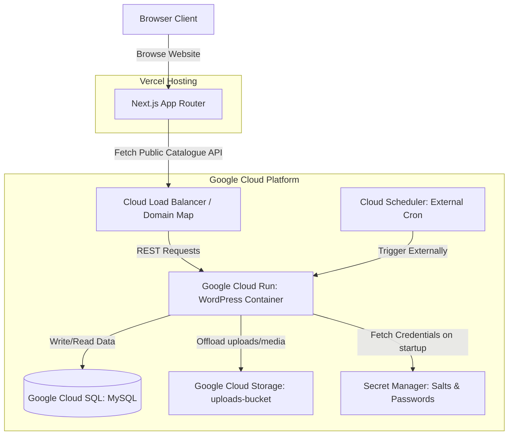

# GCP Architecture & Topography Blueprint

This document details the production architecture for the **SlotStars** casino affiliate catalog.

## Architecture Topography

---

## Component Role Matrix

1. **Next.js Frontend (Vercel)**: Serves the static page layouts and fetches clean JSON catalogs from the WordPress REST API endpoint on-demand.
2. **WordPress Core (Google Cloud Run)**: Running stateless, containerized Apache/PHP execution instances. Scales down to zero when idle to minimize costs.
3. **Database Layer (Google Cloud SQL)**: Fully-managed MySQL 8.0 instance configured with automated daily backups and Point-In-Time-Recovery (PITR).
4. **Media uploads (Google Cloud Storage)**: Standard multi-regional bucket holding persistent media. Cloud Run container directories are ephemeral, so media uploads are offloaded directly to GCS.
5. **Key Management (Secret Manager)**: Securely stores sensitive variables (salts, database passwords, bridge secrets). Mounted as server-only environment configurations in Cloud Run.
6. **Background Tasks (Cloud Scheduler)**: Sends periodic authenticated HTTP requests to run the WordPress cron loop.
